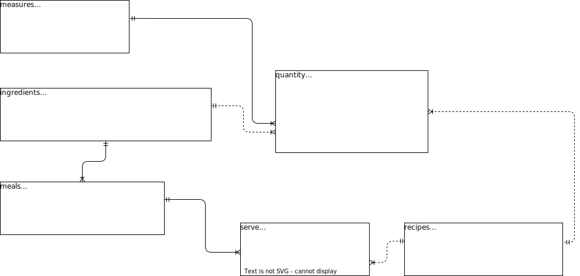

# Food-Blog-BE
Practicing Database Design and SQL related skills


## ER Diagram 



## Functionality

### Add recipes
By running 
```bash
python blog.py test.db 
```
The CLI tool will ask for recipes and their ingredients using specified quantities.

The app will only accept recipes that contain valid ingredients and measures! 


### Search for recipes
Let's say that you want to cook something and you have a some ingredients at home 😋

Hungry already ?

You can search the database for recipes that match the provided ingredients and their respective meal type !

Deciding what to cook becomes a piece of 🥧!

so in case you want to cook a healthy breakfast or brunch you could run

```bash
python blog.py test.db --ingredients=milk,strawberry,cacao --meals=breakfast,brunch
```

If the system finds related recipes it will give you a list so you can start 🧑‍🍳 ASAP!

### NOTES

Valid:
- `ingredients` are: "milk", "cacao", "strawberry", "blueberry", "blackberry", "sugar"

- `meals` are: "breakfast", "brunch", "lunch", "supper"

- `measures` are: "ml", "g", "l", "cup", "tbsp", "tsp", "dsp", ""

The above options can be extended by adding more options in the respective Database tables!

